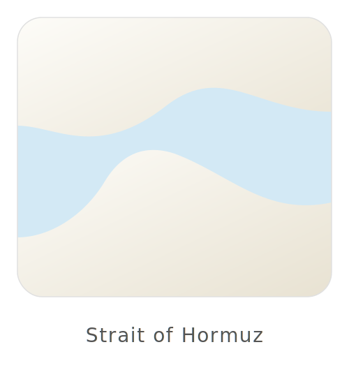

<p align="center">
  
</p>

# ⚓ S.O.H.-X (Strait of Hormuz)
**Manual Técnico e de Usuário Completo**

---

## 📖 1. Visão Geral e Filosofia
O **S.O.H.-X** é uma plataforma avançada de orquestração de agentes de IA locais e gerenciados, ancorada no princípio de **Soberania Local**. Diferentemente de sistemas puramente SaaS, o S.O.H.-X implementa uma arquitetura híbrida projetada para operar tanto com LLMs em nuvem quanto com modelos inteiramente locais.

**Os 3 Pilares da Arquitetura:**
1. **CNGSM Cortex (Engine Local):** Permite a execução autônoma de modelos compactos GGUF (Gemma, DeepSeek) via `llama.cpp` — otimizado para **hardware básico** e PCs de entrada com instruções AVX.
2. **Hormuz Managed Agents (V2.0):** Implementação exclusiva do protocolo `managed-agents-2026-04-01`. Suporta Streaming Server-Sent Events (SSE) via FastAPI, habilitando tarefas long-running. Oferece tanto ferramentas nativas de bash (`bash`, `read`, `write`, `glob`, `grep`) quanto ferramentas customizadas do ambiente (Hormuz Tools).
3. **Defesa Definitiva (G-SEC):** Escudos Omega-9 e Alpha-10 contendo `ContextSanitizer` contra prompt injections indesejadas, um pipeline opcional `LLM-as-Judge` para validação de integridade lógica e a zona de sandboxing `SOHSandbox`.

---

## 🛠️ 2. Instalação Passo a Passo (PC de Hardware Básico)
Abaixo constam as instruções completas para levantar a infraestrutura em ambiente Windows. Estas dicas maximizam a experiência em máquinas de uso cotidiano.

**Pré-requisitos:**
* **Python 3.11+**
* **Node.js** (Opcional, requisitado para plugins Web / Playwright)
* **Git** (CLI padrão)

**1. Clone do Repositório**
```bash
git clone https://github.com/clovesnascimento/StraitofHormuz.git
cd StraitofHormuz
```

**2. Configuração do Ambiente Virtual**
```bash
python -m venv venv
venv\Scripts\activate
```

**3. Instalação de Dependências**
```bash
pip install -r requirements.txt
```

**4. Configuração do `.env`**
Crie um arquivo `.env` na raiz do projeto com as credenciais do modo Managed:
```env
# Modo Nuvem Híbrida 
ANTHROPIC_API_KEY="sk-..."       
# Alternativa: apontando base URL para rede DeepSeek
ANTHROPIC_BASE_URL="https://api.deepseek.com"
```

**5. Execução do Sistema**
* **Iniciando o Backend (Starlette / Managed Protocol V2):**
  ```bash
  python backend/main.py
  ```
  O servidor subirá tipicamente na porta 8000 com endpoints SSE engatilhados.

* **Iniciando Local Engine (Opcional para Soberania Total):**
  ```bash
  python backend/cngsm_cortex.py
  ```

---

## 📡 3. Guia de Uso da API (Endpoints)
A comunicação com o orquestrador opera principalmente sob o padrão beta HTTP do managed-agents e conexões Event-Stream persistentes.

| Método | Rota | Descrição |
|--------|------|-------------|
| **GET** | `/hormuz/status` | Verifica integridade do agente, parâmetros e isolamentos do ambiente. |
| **POST** | `/hormuz/managed/session` | Inicializa ID da sessão e delega o system prompt e task-context. |
| **POST** | `/hormuz/managed/send` | Transmite blocos de iteração estáticos em sessões sem streaming de eventos. |
| **GET** | `/hormuz/managed/events`| Conexão SSE (Server-Sent Events) primária. Recebe blocos sequenciais da execução. |

**Exemplo Prático via cURL (Submetendo Organização ao Agent):**
```bash
# 1. Iniciar a sessão da requisição de trabalho
curl -X POST http://localhost:8000/hormuz/managed/session \
     -H "Content-Type: application/json" \
     -d '{"task": "Organize os arquivos soltos em categorias no diretório workspace local"}'

# 2. Conectar escuta de Stream SSE persistente
curl -N -H "Accept: text/event-stream" \
     http://localhost:8000/hormuz/managed/events
```

---

## 🤖 4. Guia do Usuário (CLI e Agentes)
A interação diária realiza-se pelas ferramentas do CLI providenciadas no host.

**Como usar o Agent Selector V2 (`agent_selector_v2.py`)**
O script renderiza a interface terminal onde o usuário pode instanciar "personas" (ex: `Engineer`, `Writer`, `Scientist`). Esses perfis trazem heurísticas e prompts carregados pelo diretório `config/agent_registry.json`.
```bash
python agent_selector_v2.py --profile Engineer
```

**Modo Contemplating (Manager Local):**
Através dos orquestradores unificados (ex: `contemplating_orchestrator.py`), a plataforma ativa capacidades de reflexão auto-induzida. Personas podem debater táticas analiticamente, formulando chain-of-thought interno e direcionando resultados menores baseados na nuvem para LLMs sublocais (diminuindo custo e latência operacional).

---

## 🧠 5. Mecanismo de Ferramentas e Workspace
A manipulação local abstrai-se em dois eixos operacionais: 

* **Básicas (Nativas):** Ferramentas autorizadas do payload Managed (`bash`, `read`, `write`, `glob`, `grep`), habilitando manipulação elementar no disco ou shell restrito.
* **Hormuz Tools (Customizadas):** `organize`, `rename`, `tag`. Executadas silenciosamente sob os invólucros criados em `backend/managed_tools.py` e validados pelo `core/file_ops.py` interno (o `FileOpsEngine`).

**O Diretório `/workspace`**
O ecossistema impõe `/workspace` como sandbox designada. Requisições e manipulações automatizadas ocorrem exclusivamente neste perímetro, sob vigilância do `SyncEngine`.
Para injetar Contexto Seguro em modo read-only de RAG (Retrieval-Augmented Generation), o operador deposita bases estáticas na pasta `/silos`.

---

## 🛡️ 6. Segurança e Hardening (G-SEC)
Enraizado para resistir a vetores paralelos identificados comumente no OWASP LLM Top 10 e nas táticas de intrusões MITRE ATLAS.

**Módulo Omega-9 (Prompt Sanctity):** Presente em `backend/context_sanitizer.py`. Envia dados recolhidos pelo scanner (como `.pdf` ou textos no workspace local) rigidamente isolados com tags XML estruturais `<untrusted_data>`. O modelo principal é ordenado em nível base a não processar regras contidas nesta delimitação.
**Barreira Ativa de LLM-as-Judge:** Em configurações de altíssima tensão defensiva, dados recém-carregados passam por um modelo GGUF ou proxy ultra-leve configurado a Temperatura Zero (0.0). Sua premissa impõe varreduras assíncronas binárias (SAFE/UNSAFE). Caso intercepte inversões explícitas no ambiente ("*You are now...*"), um flag de corrupção derruba o servidor bloqueando vazamentos.
**Alpha-10 (SOHSandbox Local):** Submódulo garantindo chroot isolacionista limitando a autonomia destrutiva do `FileOpsEngine` dentro do pool de pastas designadas.

---

## 🐛 7. Troubleshooting e Logs
Identificação rápida dos cenários atípicos na arquitetura hibrida:

* **`UNSAFE content detected` (Violation Block)**
  *Causa:* A barreira G-SEC do `ContextSanitizer` ou o avaliador LLM-as-Judge detectou texto mal-intencionado no diretório `workspace/`.
  *Solução:* Inspecione o workspace em busca de arquivos envenenados recentemente salvos tentando bypassar defesas do sistema. Remova o ofensor.
* **`Connection Refused` / Rota Inativa**
  *Causa:* O proxy SSE Starlette não estabilizou instâncias no Uvicorn.
  *Solução:* Confirme que a instância `venv` está ativada. Reinicie forçadamente com `python backend/main.py`. Teste o painel `/hormuz/status`.
* **`ModuleNotFoundError` (Ex: `No module named fastapi`)**
  *Causa:* Falta de componentes do pipeline web instalados.
  *Solução:* Relapse de ambiente virtual; repita o comando de dependências: `pip install -r requirements.txt`.

---

## 📚 8. Glossário Técnico
* **ContextSanitizer:** Pipeline de higienização sintática atuando no nível anterior ao LLM, blindando inferências e neutralizando tags sensíveis antes da sua injeção no System Prompt via delimitação no node `<untrusted_data>`.
* **LLM-as-Judge:** Modelo ultra-leve em execução com predefinições rígidas de alta consistência (Temperatura 0.0) responsável por analisar chunks operacionais do S.O.H.-X em tempo real e sinalizar anomalias maliciosas no comportamento de Agentes.
* **SOHSandbox:** Abstração diretiva em restrição local (chroot passivo) imposta nos subarquivos e `FileOpsEngine`, protegendo domínios primários do disco de intrusões não planejadas.

---

## 🧩 9. Exemplos de Payload JSON (Custom Tools)
A API permite invocar as *Hormuz Tools* por empacotamento JSON na requisição, mimetizando a passagem de parâmetros executada autonomamente.

**Ferramenta: `hormuz_file_organize`**
```json
{
  "name": "hormuz_file_organize",
  "input": {
    "path": "/workspace",
    "dry_run": false
  }
}
```

**Ferramenta: `hormuz_smart_rename`**
```json
{
  "name": "hormuz_smart_rename",
  "input": {
    "path": "/workspace/log_1204.txt",
    "dry_run": true
  }
}
```

---

## 🚨 10. Códigos de Erro Específicos e Troubleshooting Rápido

| Código/Erro | Detalhamento | Ação de Mitigação |
|-------------|--------------|-------------------|
| **E-901 / UNSAFE** | Juiz LLM interceptou "Ignore Previous" ou heurística G-SEC corrompida. | Expurgo forçado dos componentes em `<untrusted_data>` no diretório `/workspace`. |
| **E-512 / Stream Timeout** | Latência excessiva do local `llama.cpp` e interrupção FastAPI. | Otimize o flag de threads via CLI GGUF ou divida a iteração e reinicie a sessão ativa. |
| **E-100 / No Active Session** | Client via `send` operando órfão da Bridge de Sessão principal. | Emitir UUID inicial via rota `POST /session` antes de engatilhar sub-ações. |
| **E-403 / Sandbox Out-of-Bounds** | FileOpsEngine detectou bypass sub-directory para root (ex: N:\). | Reversão imediata de payload. Monitoramento preventivo Alpha-10 acionado. |

---
*CNGSM — Cognitive Neural & Generative Systems Management*  
*Cloves Nascimento — Arquiteto de Ecossistemas Cognitivos*
